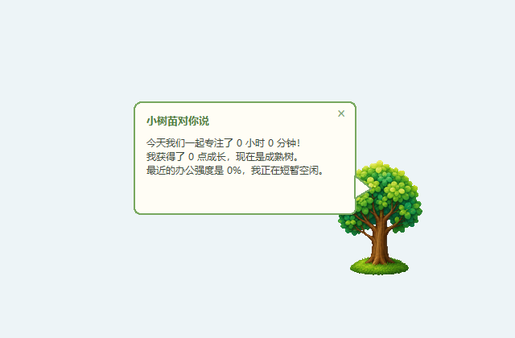

# 时尚小垃圾桌宠实验

> **源码备份说明**：Git 仓库不包含运行所需的原始图片、图标、动作帧、可执行文件或本机数据；README 展示截图除外。
> 克隆后不能直接运行完整桌宠，请先阅读 [源码备份边界与恢复说明](SOURCE_BACKUP.md)。
> 下列运行和打包说明以本机已具备相应素材为前提；轻译是独立仓库，不随此仓库上传。

## 效果预览



截图由隔离测试状态中的实际程序窗口生成，仅展示小树苗原型；不包含桌面、账号、用户数据或未授权的第三方角色素材。


## 轻译：Ctrl + E 划词翻译

独立的原生 Windows 轻量翻译工具位于 `quick_translate`：选中英文后按 `Ctrl + E`，会在鼠标附近显示中文译文。

```powershell
.\quick_translate\run.bat
```

## 当前版本：三款轻量桌宠

三款桌宠都采用原生 Win32 + GDI+，不依赖 Python、Electron 或 WebView：

```powershell
.\native_pet\run.bat
.\native_capybara_pet\run.bat
.\native_keyboard_pet\run.bat
```

- `native_pet`：吉伊轻量桌宠。
- `native_capybara_pet`：水豚噜噜轻量桌宠。
- `native_keyboard_pet`：火焰小蓝桌宠；随打字怒敲键盘、随鼠标一起推鼠标、空闲卖萌、休息睡觉。

原“小树苗桌宠”保留为历史原型，默认不再运行。

## 历史版本：小树苗桌宠

一款面向 Windows 的离线桌面宠物。它只读取系统“距离上次键鼠操作过去了多久”，不会记录按键内容、鼠标位置或当前打开的软件。

## 功能

- 清新手绘风透明悬浮树苗，可拖动
- 根据键鼠活跃状态累计今日办公时长
- 每天自动结算成长值，并保存在本机
- 破土嫩芽、小树苗、青年树、成熟树四套独立形态
- 根据近五分钟办公强度切换持续办公、平静、休眠和疲惫状态
- 单击树苗查看成长对话，双击树苗返回 Codex
- 监测 Codex 本地未读任务更新，由树苗弹出提醒
- 右键查看今日统计、暂停/恢复监测、切换置顶或退出
- 连续工作一段时间后给出休息提醒

## 启动

```powershell
python app.py
```

程序数据保存在 `%LOCALAPPDATA%\SaplingDeskPet\state.json`。首次启动后可把 `启动小树苗.bat` 的快捷方式放入 Windows 启动目录。

## 成长规则

- 每累计 25 分钟有效活跃时间获得 1 点成长值
- 每天最多获得 12 点
- 每天日期变化后自动结算；当天窗口中也会预览即将获得的成长
- 成长阶段：破土嫩芽（0 点）、小树苗（10 点）、青年树（25 点）、成熟树（50 点）
- 长期成长值只会增加，不会因为休息而倒退
- 1 分钟无操作进入平静状态，15 分钟无操作进入休眠
- 连续专注 50 分钟进入疲惫状态并提醒休息
